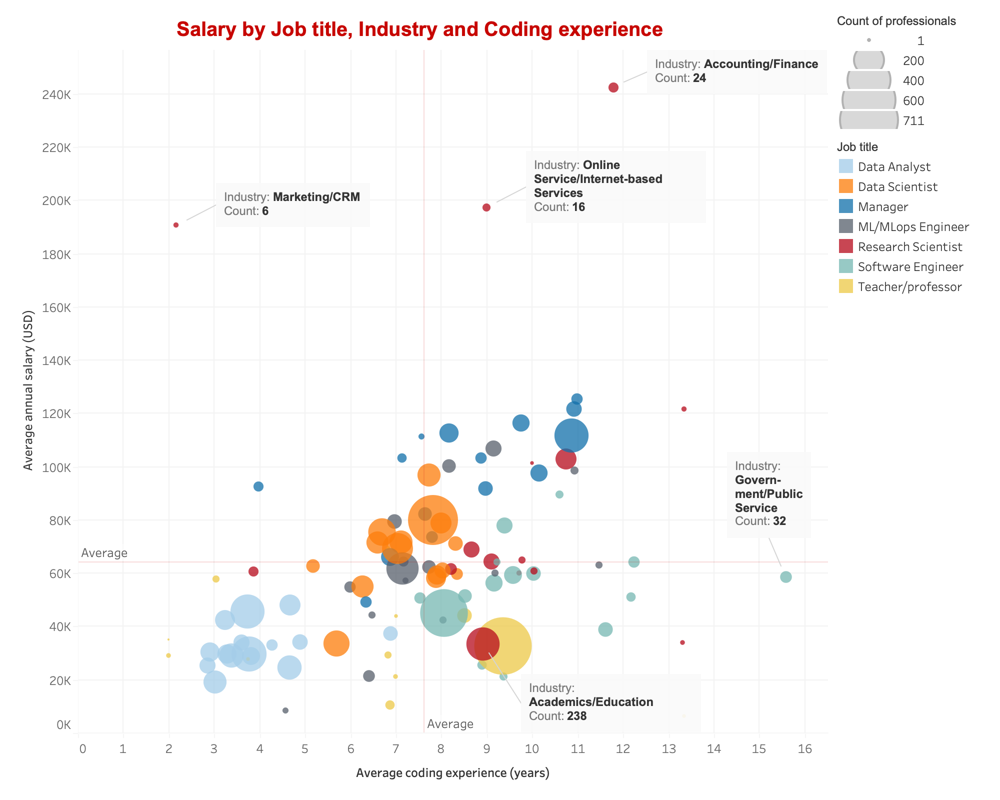

# The state of data science & machine learning 2022

Results from the 2022 Kaggle machine learning & data science survey

## 1. How salaries vary by title, industry and coding experience

This visualisation shows the average salary in USD by job title, and coding experience in each industry, with the sizes of the bubbles, scaled according to the number of respondents.

The global average coding experience and salary of the respondents are approximately 7.5 years and 63,000 USD respectively. The variation in experience and salary by title can be noted as the titles are grouped into clusters. On average, data analysts have less than 5 years of experience and a below-average salary, while software engineers have noticeably more experience but not significantly higher salaries. The extreme can be seen in software engineers working in the Government/Public service industry who have the most experience but below-average pay. Data scientists and ML engineers all have close-to-average experience and pay.

Interestingly, managers on average have higher salaries across almost all industries regardless of experience. This makes sense as managers also perform leadership duties besides technical contribution, therefore technical experience is not always strictly required.

Finally, research scientists appear to be outliers, with extremely high salaries in the marketing, internet service and finance industries, but earn the least in the academic/education industry.

## 2. How Machine Learning adoption changes across countries, industries and company sizes

This visualisation displays the state of Machine Learning (ML) adoption for each country and industry, calculated by averaging the ML adoption score (0 for not utilising ML and 4 for having used ML in production for more than 2 years) given by the respondents in each category.

In the first chart, the popularity of ML in each country was calculated by dividing the number of respondents by the country’s population. It indicates that ML is more popular and has a high level of adoption in the USA, Europe and developed Asian countries such as Japan and Singapore. In contrast, most countries in Africa and Latin America have not adopted ML or are still in the exploration phase and with a low level of ML popularity. Interestingly, in the United Arab Emirates, ML adoption is still immature despite its popularity.

The second chart indicates a significant variation in ML adoption by industry and company size. For instance, adoption in Academics/Education is lowest while Insurance/Risk assessment and Online/Internet service are highest. Generally, across all industries, bigger companies tend to adopt ML more than smaller ones. However, in the Academics/Education and Shipping/ Transportation industries, small and medium companies are leading in the adoption process.

## 3. Data professionals’ genders and titles in different industries

The chart suggests that the most popular job titles are data scientists and data analysts, globally and for the majority of industries. In Academics/education, the most popular titles are teacher/professor and research scientist, while on the other hand, software engineers and data scientists are most prominent in computer/technology.

Interestingly, the visualisation suggests that all fields and professions are dominated by males. The least male-dominated industries are Academic/Education and Medical/Pharmaceutical with the female proportion slightly exceeding 25%. This is consistent with the common knowledge that STEM is mostly a male-dominated field.

## 4. Education and research background of Data Professionals

This indicates more than 80% of the professionals in all positions have at least a Bachelor’s Degree. In contrast, Developer Advocates have the highest percentage of professionals without degree (around 20%) while the figure is less than 10% for the other groups. Notably, for Data Scientists, Research Scientists, Statisticians, and Teachers/Professors, these numbers are around and under 5%, while the proportions of people with a Doctoral Degree are highest among all positions which are 17.99%, 53.97%, 23.01%, and 51.59% respectively.

Generally, ML is used in applied research more than theoretical research for all roles, except for Developer Advocates (10% applied compared to 30% theoretical). Interestingly, Research scientists and Teachers/Professors used ML more in applied research than in theoretical research, but at the same time among the groups who apply ML in research the least. These are also the two groups that utilise ML in applied research the most. ML/ MLops engineers, Data Scientists have the highest rates of professionals with ML utilised in theoretical research which are around 29%, 25%, 19% and 15% respectively.

## 5. The use of technologies and algorithms by data professionals

The first graph shows that Python is the most popular programming language for all positions, especially ML/MLops Engineers, Data Engineers, Data Architects, and Data Scientists with more than 80% being Python users. SQL comes second and is mostly utilised by Data Engineers and Data Architects since these professionals often deal with database management and operations. R ranks third and is mostly used by Statisticians due to its focus on statistics-related libraries.

The second chart demonstrates that AWS (Amazon Web Services) is the most prominent platform, except for Teachers/Professors, Data Administrators, and Developer Advocates who prefer GCP (Google Cloud Platform). Generally, Data Architects and ML/MLops Engineers have the highest rates of cloud platform users at around 45% while Statisticians have the lowest rate at 15%. This makes sense as statisticians work more on inference which does not always require deploying a solution in production.

Linear and Logistics Regression are widely utilised by all groups, except for ML/MLops Engineers and Research Scientists with 80% and 60% preferring Neural Networks respectively. Engineers (non-software) and Data Administrators are the least frequent user of Machine Learning algorithms with around 40% using them in their work.
